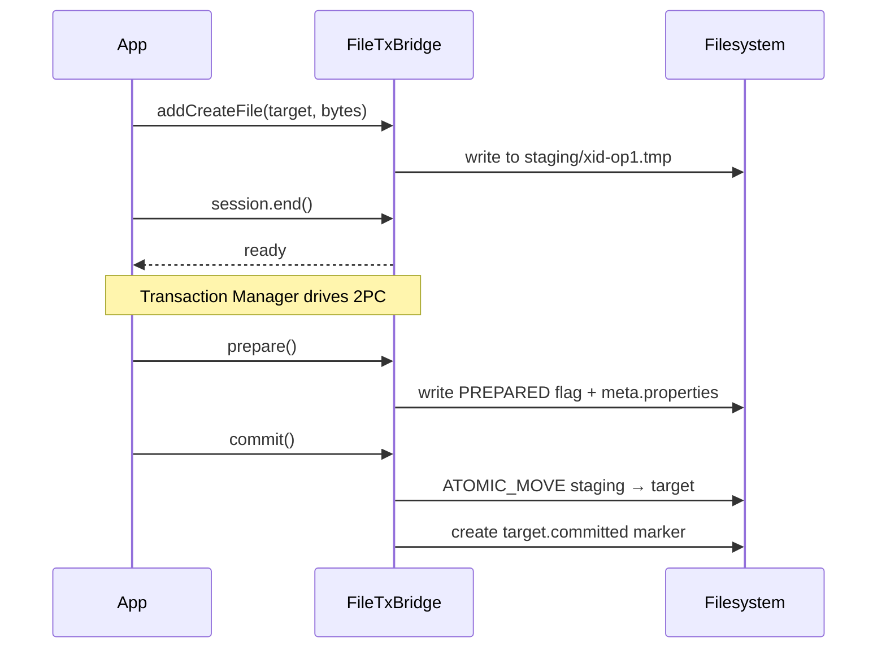
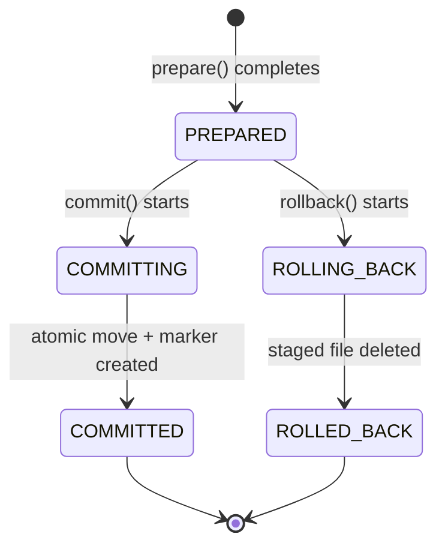
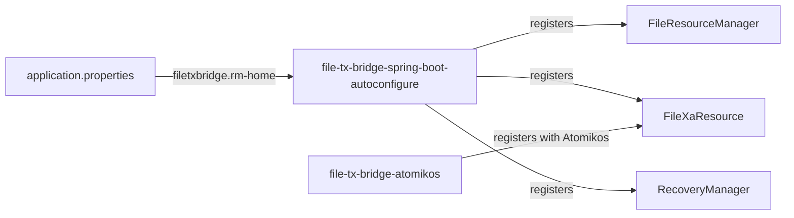
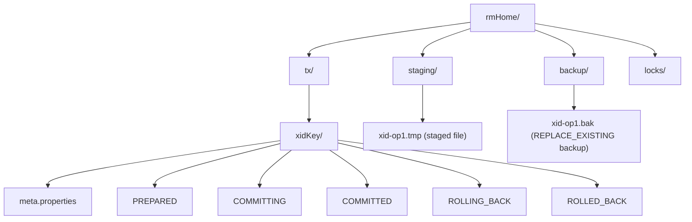
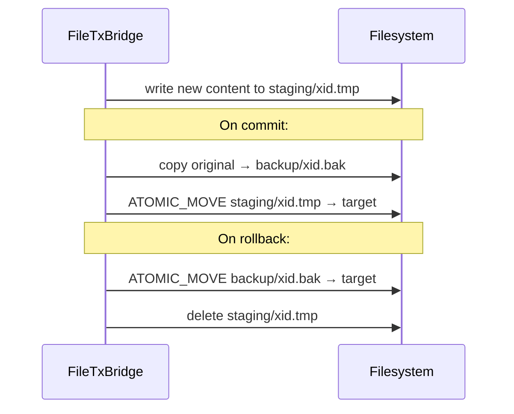

# Coordinating File Writes With JTA Transactions Using FileTxBridge

## The Problem Nobody Talks About

You've got a Spring Boot service. It saves a record to the database *and* writes a file to disk — say, a CSV report. Easy enough. But what happens if the JVM crashes right after the database commit, before the file is written?

You end up with a database row pointing to a file that doesn't exist yet. Or the opposite: a file on disk with no corresponding database record.

Databases handle this with **XA two-phase commit (2PC)**. Filesystems don't. There's no standard way to say "write this file, but only if my database transaction commits." That's the gap **FileTxBridge** fills.

---

## The Core Idea: Stage First, Move on Commit

Instead of writing directly to the target path, FileTxBridge writes to a *staging* file first. The real file only appears at the target location when the transaction commits — using an atomic rename. If the transaction rolls back, the staged file is simply deleted.

Here's the flow:



The atomic move is the key: the file either appears fully at the target path, or it doesn't appear at all. No partial writes, no half-visible content.

---

## Crash Recovery: Flags on Disk

What if the JVM crashes between `prepare()` and `commit()`? FileTxBridge persists the transaction state as flag files so it can pick up where it left off.



On startup, `RecoveryManager` scans the `rmHome/tx/` directory. Any transaction stuck in `PREPARED` or `COMMITTING` is surfaced to the JTA transaction manager, which then drives the final commit or rollback.

---

## Quick Start: Plain Java

```java
// Set up once per JVM
FileResourceManager rm = new FileResourceManager(Path.of("/var/lib/my-app/file-tx"));
FileXaResource xaResource = new FileXaResource(rm);
new RecoveryManager(rm, xaResource).performStartupRecovery();

// Per-transaction usage
tm.begin();
Transaction tx = tm.getTransaction();

FileXaSession session = new FileXaSession(rm);
tx.enlistResource(session.getXaResource());

session.begin(currentXid(tx));
session.addCreateFile(
    Path.of("/data/reports/report-2024.csv"),
    Path.of("/data/reports/report-2024.csv.committed"),
    csvBytes,
    WriteMode.CREATE_NEW
);
session.end();

tm.commit();
// Both files now visible: report-2024.csv and report-2024.csv.committed
```

The `.committed` marker file is a lightweight signal your application can poll to confirm durable completion — no need to open the file itself.

---

## Spring Boot Integration

If you're already on Spring Boot 3.x with Atomikos, there's an autoconfigure module that handles all the bean wiring for you.



Add the dependencies:

```xml
<dependency>
    <groupId>com.example</groupId>
    <artifactId>file-tx-bridge-spring-boot-autoconfigure</artifactId>
    <version>1.0.0-SNAPSHOT</version>
</dependency>
<dependency>
    <groupId>com.example</groupId>
    <artifactId>file-tx-bridge-atomikos</artifactId>
    <version>1.0.0-SNAPSHOT</version>
</dependency>
<dependency>
    <groupId>org.springframework.boot</groupId>
    <artifactId>spring-boot-starter-jta-atomikos</artifactId>
</dependency>
```

Configure a single property:

```properties
filetxbridge.rm-home=/var/lib/my-app/file-tx
```

Then use it in a `@Transactional` service:

```java
@Service
public class ReportService {

    @Transactional
    public void generateReport(String reportId, byte[] csv) throws Exception {
        reportRepository.save(new Report(reportId));   // DB write

        FileXaSession session = new FileXaSession(fileRm);
        Transaction tx = jtaTm.getTransaction();
        tx.enlistResource(session.getXaResource());

        session.begin(currentXid(tx));
        session.addCreateFile(
            Path.of("/data/reports", reportId + ".csv"),
            Path.of("/data/reports", reportId + ".csv.committed"),
            csv,
            WriteMode.CREATE_NEW
        );
        session.end();
        // Spring commits → TM calls prepare() then commit() on both the DB and file resources
    }
}
```

The Atomikos module auto-registers `FileXaResource` with Atomikos at startup. Without this registration, Atomikos can't recover the resource after a crash — it needs a factory to reconstruct it by name. Both autoconfigure modules together take care of this with zero boilerplate.

---

## Directory Layout

Here's what FileTxBridge puts on disk:



One thing worth noting: `rmHome` must live on the **same filesystem** as your target directories. The atomic move fails across filesystem boundaries — FileTxBridge will throw an `XAException` if you try.

---

## Replacing an Existing File

The `REPLACE_EXISTING` mode handles transactional file updates. The original is backed up before the swap, and restored on rollback:



---

## Abandoned Transaction Cleanup

Transactions that crash *before* `prepare()` — say, a JVM killed mid-write — leave orphaned staging directories that `recover()` can never see. (A resource is only supposed to report branches it voted YES on, and these never got that far.) Without cleanup, they pile up indefinitely.

The autoconfigure module runs a scheduled sweep to handle this:

```properties
filetxbridge.cleanup.interval=1h    # how often to sweep (default: 1h)
filetxbridge.cleanup.max-age=24h    # minimum age before deletion (default: 24h)
```

The `max-age` isn't a safety requirement — these directories are permanently unreachable regardless of age. It's just a grace period so you can inspect them before they're gone.

---

## Know the Limits Going In

FileTxBridge is upfront about what it can't do. Here's a quick summary:

| What | Why it matters |
|---|---|
| No isolation between transactions | Other processes can still touch your files mid-transaction |
| Same-filesystem requirement | `ATOMIC_MOVE` doesn't cross mount points |
| Weaker durability on Windows | Directory `fsync` is a no-op; crash safety is reduced |
| Higher heuristic risk | A full disk or deleted staging file after `prepare()` produces `XA_HEURHAZ` |
| No deadlock detection | Advisory lock files can be ignored by other processes |

These aren't deal-breakers in most cases, but they're worth understanding before you ship to production.

---

## Is It Right for Your Project?

FileTxBridge is a good fit when:

- You're already using JTA/XA (Atomikos, Narayana, Bitronix) for database transactions
- You want file creation and database writes to succeed or fail together
- Your staging directory and target files live on the same filesystem
- You can accept *best-effort* transactional guarantees on the file side — not the strict guarantees of a database

It's not the right tool for syncing files across network shares, or for use cases that need strict read isolation.

---

## Wrapping Up

Transactional file writes are one of those problems that seems simple until you hit a crash at the wrong moment. FileTxBridge gives you a practical, XA-compatible solution built on staging files and atomic renames — with honest documentation about where its guarantees end.

The Spring Boot and Atomikos integration modules make it straightforward to add to an existing application, and the autoconfigure handles the tedious parts (bean registration, startup recovery, abandoned-transaction cleanup) out of the box.

**Repository:** [github.com/rrobetti/file-tx-bridge](https://github.com/rrobetti/file-tx-bridge)
